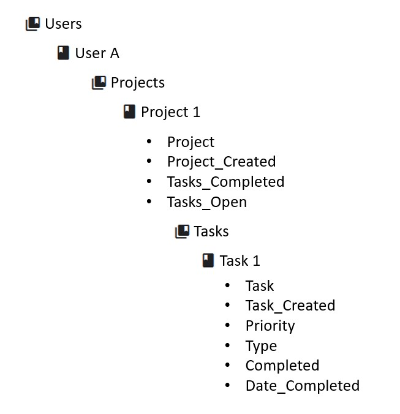

# Task Management

Task Management is an application built on React and combined with Firebase for the backend. It allows you to create and manage tasks between several different projects.

Firestore Data Model

